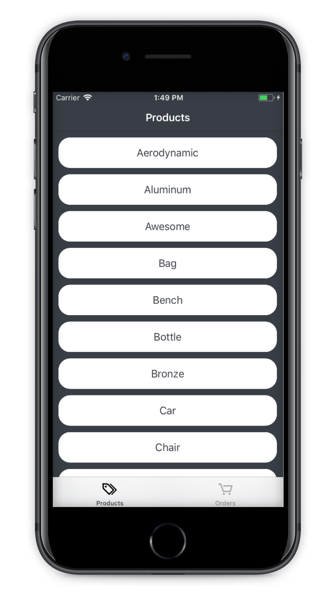
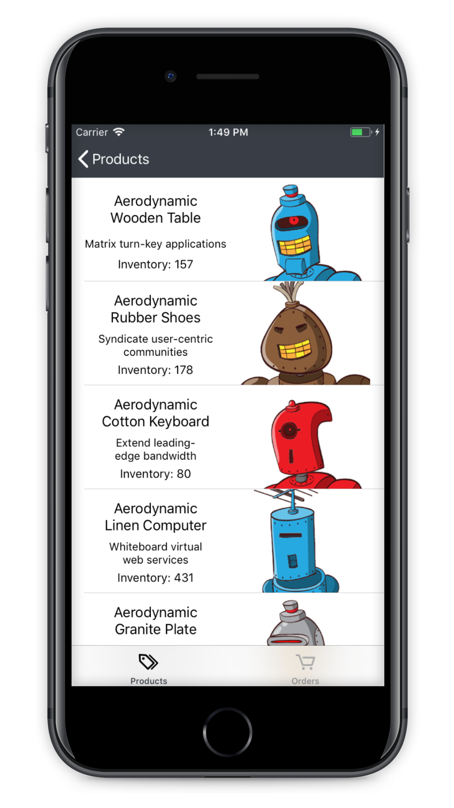
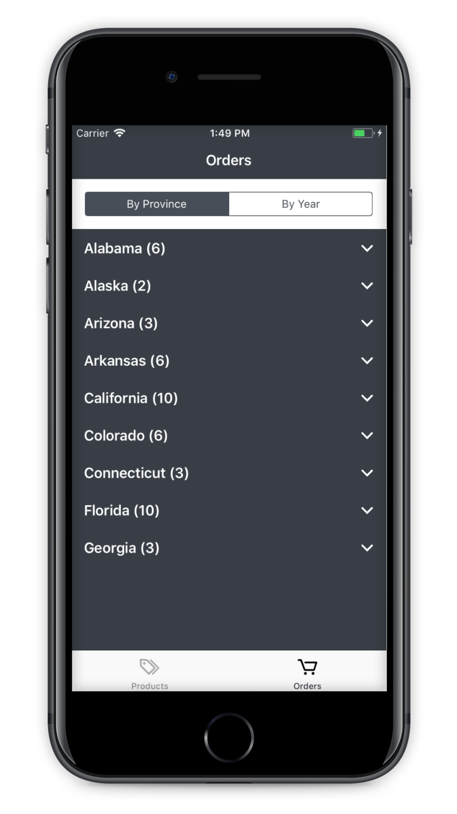
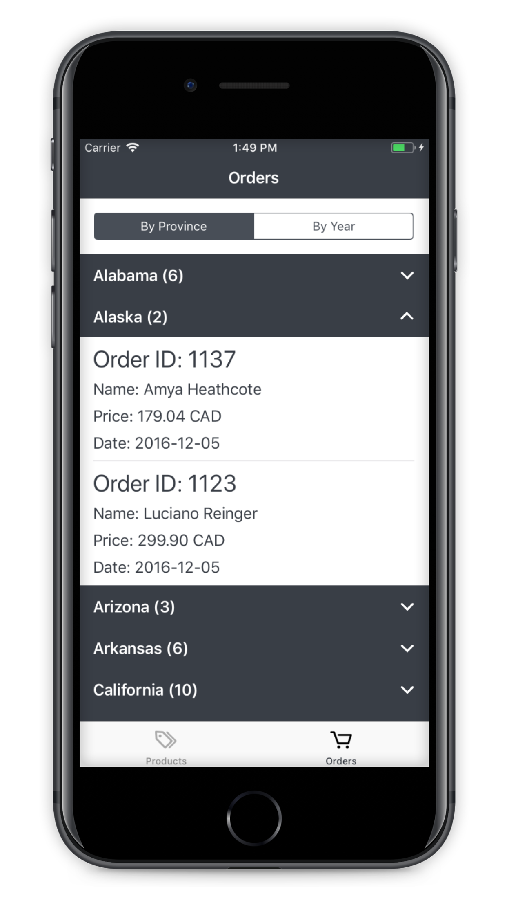

# Order Summary App
> Browse your products and keep track of your orders.

[![Build Status][travis-image]][travis-url]
[![License][license-image]][license-url] 

Shopify's iOS Mobile Internship Challenge of Fall 2018 & Winter 2019 combined.

## Features

- [x] Displays an Order Summary Page
- [x] Orders are sorted by province and year
- [x] Displays a list of products tags
- [x] Products are sorted by tags

## Build

- iOS 11.0
- Xcode 9.4.1

## Libraries

- [Alamofire](https://github.com/Alamofire/Alamofire)
- [Alamofire Image](https://github.com/Alamofire/AlamofireImage)
- [Swifty JSON](https://github.com/SwiftyJSON/SwiftyJSON)
- [SwiftIcons](https://github.com/ranesr/SwiftIcons)

## Meta

Alexandre Gravelle – [@WBiOSD111](https://twitter.com/WBiOSD111?lang=en) – wbiosd111@gmail.com

[https://github.com/WBiOSD111](https://github.com/WBiOSD111)

[swift-image]:https://img.shields.io/badge/swift-3.0-orange.svg
[swift-url]: https://swift.org/
[license-image]: https://img.shields.io/badge/License-MIT-blue.svg
[license-url]: LICENSE
[travis-image]: https://img.shields.io/travis/dbader/node-datadog-metrics/master.svg?style=flat-square
[travis-url]: https://travis-ci.org/dbader/node-datadog-metrics
[codebeat-image]: https://codebeat.co/badges/c19b47ea-2f9d-45df-8458-b2d952fe9dad
[codebeat-url]: https://codebeat.co/projects/github-com-vsouza-awesomeios-com
